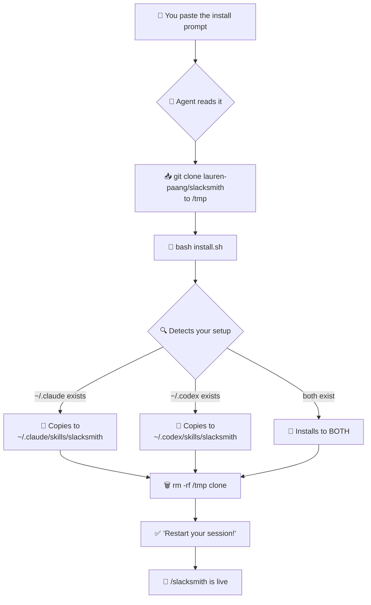
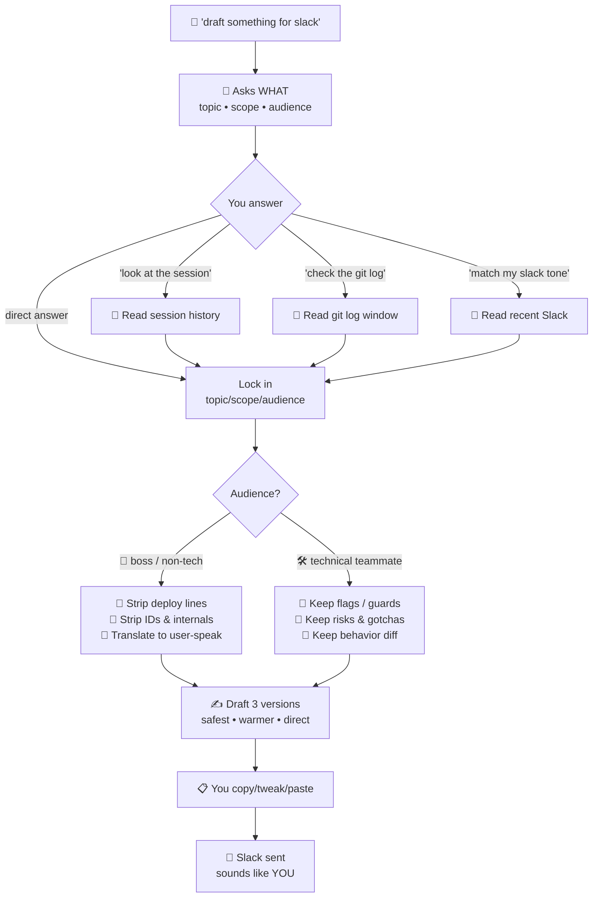
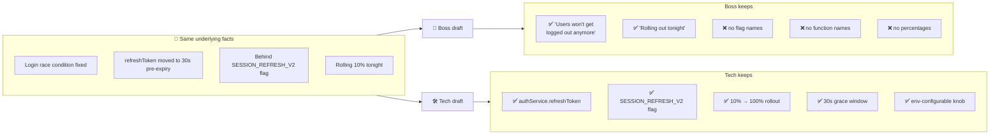

# 🔨 slacksmith

> **Forge Slack messages that sound like *you* — not a release bot.**

Your teammate is waiting. Your commit history is a mess. Your draft reads like a LinkedIn post written by a toaster.

**Slacksmith** is a Claude Code / Codex skill that writes Slack updates in your real voice — short, personal, and believable. For project updates, check-ins, follow-ups, or status notes.

```
"use slacksmith to message my boss about the auth fix"
         ↓
Quick update on the auth fix:

1. Login now survives the token refresh race I mentioned Monday.
2. Nothing user-visible changed — same screens, same clicks.
3. Rolling out behind a flag tonight, watching error rates in the morning.

Let me know if anything looks off on your end.
```

No robot voice. No bullet vomit. No "I am an AI assistant and I have completed the following tasks."

---

## ✨ What it actually does

| You say | Slacksmith gives you |
|---|---|
| `draft a slack message about X` | A clean 2–5 line draft in your tone |
| `give me 3 versions` | Safe • warmer • more direct |
| `boss-facing vs tech-facing` | Two audience-tuned versions of the same update |
| `use my recent Slack tone` | Reads your recent Slack via the Slack plugin and matches it |
| `@Alex` | Resolves the real Slack mention if a Slack plugin is connected; falls back to plain `@Name` otherwise |

### 🎯 Audience-aware by design

Slacksmith asks *who the message is for* before it drafts:

- **Boss / non-technical** — product behavior, user-visible outcomes, what to test. No IDs, no endpoint names, no internals.
- **Technical teammate** — what changed in behavior, what flag / guard flipped, what risks remain, what to watch.

Same update, two very different drafts.

---

## 📦 Install

### 🧠 Lazy-mode install — let your agent do it

Already chatting with **Claude Code** or **Codex**? Don't switch windows. Paste one of these and your agent handles the rest 👇

**🪄 Short & sweet**

> yo, grab `lauren-paang/slacksmith` from github and install it for me. run the `install.sh`, clean up after yourself, and tell me when to `/clear`.

**☕ Polite version**

> hey, could you install the slacksmith skill for me? repo is `github.com/lauren-paang/slacksmith` — clone it somewhere temporary, run `install.sh`, then delete the temp folder. ping me when it's ready to use.

**🏗️ Builder vibe**

> forge time. clone `lauren-paang/slacksmith`, run the installer, nuke the temp clone, and tell me the magic words to activate it.

**😎 Absolute minimum**

> install `lauren-paang/slacksmith` from github plz

Your agent will clone, run the installer (auto-detects Claude Code + Codex), confirm success, and tell you when to restart. That's it.

---

### 🗺️ What the agent actually does when you paste that



Takes ~10 seconds. No manual cp, no path guessing, no broken symlinks.

---

### 🖥️ Claude Code

**Option A — one-liner:**

```bash
git clone https://github.com/lauren-paang/slacksmith.git /tmp/slacksmith && bash /tmp/slacksmith/install.sh && rm -rf /tmp/slacksmith
```

**Option B — manual symlink (so `git pull` in one place updates the skill):**

```bash
git clone https://github.com/lauren-paang/slacksmith.git ~/code/slacksmith
ln -s ~/code/slacksmith ~/.claude/skills/slacksmith
```

**After install:** quit and relaunch Claude Code, or run `/clear`. You'll see `slacksmith` in the skills list. Invoke with `/slacksmith` or "use slacksmith to draft a slack message about …".

---

### 🤖 Codex (OpenAI CLI)

**Option A — one-liner:**

```bash
git clone https://github.com/lauren-paang/slacksmith.git /tmp/slacksmith && bash /tmp/slacksmith/install.sh && rm -rf /tmp/slacksmith
```

The installer auto-detects `~/.codex/` and drops the skill into `~/.codex/skills/slacksmith`.

**Option B — manual symlink:**

```bash
git clone https://github.com/lauren-paang/slacksmith.git ~/code/slacksmith
ln -s ~/code/slacksmith ~/.codex/skills/slacksmith
```

**After install:** restart your Codex session. Codex will surface slacksmith via its skill discovery (the `agents/openai.yaml` file provides the display metadata).

---

### 📥 Zero-git option (any platform)

1. Go to **https://github.com/lauren-paang/slacksmith**
2. Click the green **Code** button → **Download ZIP**
3. Unzip and move the folder to:
   - `~/.claude/skills/slacksmith` (for Claude Code)
   - `~/.codex/skills/slacksmith` (for Codex)
4. Restart your session.

---

## 🗣️ How to call it

Plain English works. All of these are valid:

```
use slacksmith to draft a short update for my tech colleague
slacksmith — give me 3 versions
slacksmith, use my recent Slack tone, keep it warm
slacksmith, scope only the database workflow part
slacksmith with @Alex if possible
```

Or just `/slacksmith` and tell it what you want.

---

## 🎬 What a real session looks like

Here's the full pipeline in action — from a cold "draft something for Slack" to a sent-ready message:

### Step 1 — You start with a vague ask

```
you: /slacksmith i need to tell my boss about what we fixed today
```

### Step 2 — Slacksmith asks WHAT

Before drafting a single word, it locks down the three things that matter: **topic, scope, audience**.

```
slacksmith:
Before I draft — a couple of quick things:

1. What's the one thing this message should focus on?
   (the login fix? the whole day's work? something else?)

2. Who's the audience — non-technical boss, or technical teammate?

3. How broad — just today, or this week?
```

### Step 3 — You answer, or tell it to look

You can answer directly — or ask it to figure things out from context:

```
you: look at this session and today's git log, audience is my non-technical boss,
     just today
```

Slacksmith then pulls from what's available:

- **Current session** — what you two were just working on
- **Codebase / git log** — only if you asked for it, only for the window you said
- **Recent Slack history** — via the Slack plugin, *for tone matching only*, never to fabricate content

It won't silently rummage through your git history. If it wants more context, it asks.

### Step 4 — You tell it to draft

```
you: ok draft it, 3 versions
```

### Step 5 — You get clean, human-sounding drafts

```
slacksmith:

━━━ Version 1 (safest) ━━━
Quick update on the login issue:

1. Users getting kicked out mid-session should be fixed now.
2. Nothing changed on their screen — they'll just stop seeing the problem.
3. Turning it on for everyone tonight, watching tomorrow morning to confirm.

Let me know if anyone still reports it.

━━━ Version 2 (warmer) ━━━
Hey — quick one on the login thing you flagged yesterday.

1. Fixed. People won't randomly get logged out anymore.
2. No visible change for users, same screens and same clicks.
3. Going live tonight — I'll check in tomorrow and let you know.

━━━ Version 3 (more direct) ━━━
Login fix is ready. Rolling out tonight.
Users won't notice anything different — they just stop getting
kicked out. I'll confirm it's holding in the morning.

Suggested scope: today only, non-technical audience, session + git log context.
```

Notice what's **not** there: no table names, no endpoint names, no "deployed to dev via CodePipeline," no commit hashes. That's the boss-audience self-check at work.

### Step 6 — You pick, tweak, paste

Copy your favorite, edit a word or two, paste into Slack. Done.

> 💡 If you have the Slack MCP plugin installed, you can also ask: *"slacksmith, post Version 2 to #engineering as a draft"* and it'll save a draft directly in Slack for you to hit send on.

### 🗺️ The same pipeline, as a flowchart



---

## 🛠️ Example 2 — The tech-teammate flow

Same day, same fix — but now you're messaging your backend teammate who actually needs the internals.

### Step 1 — The ask

```
you: /slacksmith same login fix but for @dave on the backend team,
     he wants to know what actually changed
```

### Step 2 — Slacksmith reads context, skips questions

Because you named a person and gave a clear topic, it doesn't ask for topic/scope/audience. Audience is obviously technical. Minimal-prompt mode kicks in:

```
slacksmith:
Reading session + recent commits touching auth/session code.
Any risks or known sharp edges I should flag for Dave?
```

### Step 3 — You answer the one thing it asked

```
you: yeah the refresh token grace window is now 30s,
     flag it as worth monitoring
```

### Step 4 — You get a tech-tuned draft

```
slacksmith:

━━━ Version 1 ━━━
Login fix merged — `authService.refreshToken` was racing the
session expiry. Moved the refresh to happen 30s before expiry
instead of on 401, so we stop double-refreshing under load.

Feature-flagged behind `SESSION_REFRESH_V2`, rolling at 10%
tonight → 100% tomorrow if error rates stay flat.

@dave — worth keeping an eye on the 30s grace window. If it's
too tight under high-latency networks we can bump to 60s
without redeploying (it's env-configurable).

━━━ Version 2 (shorter) ━━━
Auth race fix is in — refresh now fires 30s pre-expiry instead
of reactively on 401. Behind `SESSION_REFRESH_V2`, 10% tonight.
@dave heads up: the 30s window is env-tunable if it turns out
tight.

Suggested scope: today's commit set, technical audience, included @dave mention.
```

Notice what **is** there this time: the commit-level detail, the feature flag name, the config knob, the rollout percentages. All the stuff that got stripped for the boss version — because Dave actually needs it.

### 🗺️ Boss version vs. tech version — side by side



Same content, two completely different messages. That's the whole point.

---

## 🛠️ Example 3 — The one-line ping

Sometimes you just need to send a quick check-in, not a full update.

```
you: /slacksmith quick ping to @alex asking if he needs the staging
     db refreshed before his demo tomorrow

slacksmith:
@alex — do you want me to refresh staging before your demo tomorrow?
Happy to kick it off tonight if it helps.
```

That's it. One message, no versions, no scope questions. Minimal-prompt mode + clear topic = instant draft.

---

## 🧭 Good fit if...

- You write a lot of Slack updates and they all start feeling like changelogs
- You want boss-version and tech-version of the same message on demand
- You want mentions actually resolved to real Slack user IDs (when the Slack plugin is installed)
- You like your tools with personality

## 🚫 Not the right tool if...

- You want a formal changelog generator → try a release-notes bot
- You want AI to autonomously post to Slack without review → slacksmith always returns drafts
- You want it to invent information → it reads your session / codebase / Slack context and is deliberately conservative about "what we can prove"

---

## 🛠️ Under the hood

```
slacksmith/
├── SKILL.md              ← the brain (tone rules + workflow)
└── agents/
    └── openai.yaml       ← Codex display metadata
```

- **Harness-agnostic**: works in Claude Code, Codex CLI, and any tool that reads the standard `SKILL.md` frontmatter.
- **No network calls of its own** — it uses whatever Slack / git / filesystem tools your harness already has.
- **Tone-first**: the skill is deliberately opinionated about *not* sounding like AI. See the "Tone Rules" section in `SKILL.md`.

---

## 💡 Philosophy

> Good Slack messages are **short, specific, and sound like a human typed them.**

Most AI writing tools optimize for impressive. Slacksmith optimizes for *believable*. A 3-line message your boss actually reads beats a 12-bullet summary they skim.

Content comes from the session. Tone comes from your Slack history. Nothing is invented.

---

## ♻️ Updating

Already installed via `git clone`? Pull the latest:

```bash
cd ~/.claude/skills/slacksmith && git pull
# and if you installed for Codex too:
cd ~/.codex/skills/slacksmith && git pull
```

Then restart Claude Code (or `/clear`) so it picks up the new version.

---

## 🤝 Contributing

PRs welcome — especially new message shapes, audience buckets, or tone rules that have worked for you in real teams. Open an issue first if you're planning something big.

## 📜 License

MIT. Forge freely.

---

<sub>Built with Claude Code • Drop a ⭐ if slacksmith saved you from one more robotic Slack message.</sub>
